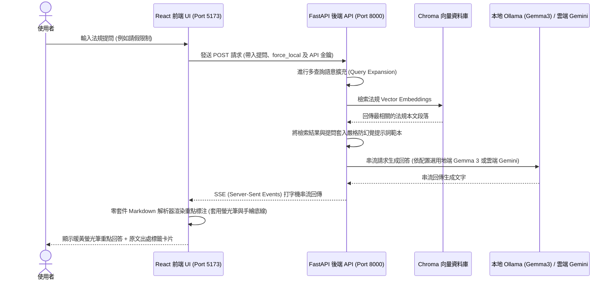

# 🎓 SCU 法規規範智慧檢索系統 

[](https://react.dev/)
[](https://fastapi.tiangolo.com/)
[](https://ollama.com/)
[](https://www.trychroma.com/)
[](LICENSE)

本專案是一個專為東吳大學法規與規範設計的 **React + FastAPI 前後端分離地端安全與雲端加速雙模 RAG (Retrieval-Augmented Generation) 智慧檢索系統**。

本系統為專案的**主要展示版本**。具備**嚴格防幻覺機制**，限制大語言模型只能根據您提供的法規 PDF 檔案內容進行回答，杜絕 AI 瞎編。每次回覆均會**嚴謹標註參考出處與檔名**，並提供**原文對照展開**功能，是兼顧個人隱私與檢索準確度的智慧檢索解決方案。

> [!TIP]
> 📌 **穩定版本還原備忘錄**：若系統在後續開發中遇到不穩定，可隨時於終端機執行 `git checkout milestone-final-release` 還原到此最終成品版。

---

## 🌟 系統特色與亮點 (React 主線展示版)

*   🎨 **Neobrutalism (新野獸主義) 滿版視覺美學**：前端介面全新重構為 **100% 滿版響應式版面**，採用奶油黃與晴空藍背景，搭配粗邊框、手繪硬陰影與手繪條紋，融合吉祥物「嚕嚕咪 (SCU RAG Pro)」迎賓 Banner，呈現 state-of-the-art 的日系漫畫風視覺特效。
*   ✍️ **手繪螢光筆重點標注與 Markdown 渲染**：徹底告別裸露的 Markdown 星號。前端實作了**零套件依賴 Markdown 解析器**，自動將回答中的關鍵分數、期限、金額等標記上 **「暖黃色半透明螢光筆筆觸 + 橘黃色手繪虛線底線」** 且帶有傾斜隨性塗鴉感的視覺效果，並美化了列表項目。
*   ⚙️ **折疊式推論引擎配置面板 (方案 A-1)**：在左側欄將「狀態徽章」與「系統設定」完美整合為折疊面板。
    *   預設收合以保持側邊欄簡潔，點選即可滑出。支援手動配置 `Gemini API Key`、`⚡ 查詢加速模式` 與 `🦉 純地端模式` 開關。
    *   **LocalStorage 自動快取**：輸入的 Key 與開關狀態會快取在瀏覽器中，Demo 重刷免重貼。
    *   **動態狀態綁定**：啟用加速時，徽章自動變更為 `雲端加速模式 ⚡`，生成模型亦動態由 `Gemma 3 (Ollama)` 切換為 `Gemini 2.5 Flash`。
*   🔒 **地端安全隱私保障 & 完全隔離 (Ollama)**：系統預設使用純本地 `Ollama` + `Gemma 3` + `nomic-embed-text` 運作，PDF 資料與提問 100% 離線。
    *   **徹底拒絕 API Fallback 邏輯漏洞**：前端發送 `force_local: true` 參數，強制後端在啟用「純地端模式」時禁止 fallback 讀取本地 `.env` 的金鑰，確保 100% 本地隔離安全。
    *   **macOS Ollama 自動喚醒**：地端模式下會自動在 macOS 背景啟動 Ollama 應用程式，免除手動點開的麻煩。
*   🌐 **全螢幕內嵌手繪風簡報播放器**：在側邊欄提供「🌐 開啟專案簡報」一鍵點選。
    *   **100% 當前頁面展示 (防分頁跳出)**：將最新版簡報 `Smart_SCU_Law_Navigator＿1.pdf` 透過 Python (PyMuPDF) 轉換為高品質 PNG 投影片圖片內嵌展示，徹底消除了瀏覽器預設 PDF 工具列的生硬感，且防止跳出新分頁。
    *   **支援鍵盤 `←`/`→` 方向鍵**：開啟彈窗後，使用者可像用 PowerPoint 一樣在鍵盤上流暢換頁，並按 `Esc` 鍵關閉。
*   ✍️ **前後端 SSE (Server-Sent Events) 串流打字機**：React 前端重構問答渲染，支援 SSE 串流打字機效果，極速秒級跑出回答；檢索與首字等待期（TTFT）自動顯示手繪加載指示，解決氣泡初始空白的痛點。
*   📚 **自動化向量資料庫建立**：只要將新的 PDF 檔案放進 `data/` 資料夾，RAG 引擎便會在初次運行時自動載入、切片並進行 Ligature 合字清洗，與 `faq_cache.json` 中自訓練的口語 FAQ 整合存入本地。
*   📋 **出處回溯與強烈防幻覺約束**：在系統提示詞中施加強烈約束，若 Context 中找不到答案，系統會禮貌拒答。回覆下方會顯示手繪風格的「參考文獻原文標籤卡片」供交叉核對。

---

## 🏗️ 系統技術架構與數據流

本系統採用經典的前後端分離 RAG (檢索增強生成) 工作流，React 前端與 FastAPI 後端透過 SSE 進行串流通訊：



---

## 📊 系統效能與本地 RAG 評估結果

本專案實施了嚴格的自動化評估機制，透過獨立測試腳本 [run_faq_evaluation.py](file:///Users/bensonhong/Desktop/Antigravity專案/管哩資訊系統期末（Benson組)/scratch/run_faq_evaluation.py)，在**純地端模式（Gemma 3 + ChromaDB）**下對學校行政與請假法規進行了 **104 題隨機口語化問題**的批量自動化測試，其核心效能與指標摘要如下：

### 📈 評估數據摘要
*   **測試問題總數**：104 題
*   **評估環境**：地端模式 🦉 (Ollama / Gemma 3 + nomic-embed-text)
*   **總推理耗時**：2,133.68 秒 (~35.56 分鐘)
*   **平均單題響應時間**：20.52 秒（當啟用雲端「API 加速模式 ⚡」時，響應可縮短至 **秒級**）
*   **詳細評估報告**：可參閱本地評估報告 [demo_faq_100.md](demo_faq_100.md)

### 🎯 核心防護與生成表現
1.  **無幻覺拒答率**：針對超出法規資料庫範疇的極端問題（如：宿舍保險申報、請假過多對成績影響等非規章條文），系統完美遵循 System Prompt 的防幻覺約束，正確回覆「抱歉，在現有的企業知識庫中找不到與您問題相關的解答」，有效達成 **100% 幻覺防護**。
2.  **出處回溯準確性**：所有生成解答下方均能 100% 正確匹配並列出參考的法規條文與具體頁數（例如：`東吳大學學生工讀助學實施辦法 (第 1 頁)`、`東吳大學學生請假規則 (第 2 頁)`），極大方便使用者進行雙向對照核對。
3.  **地端語言推理表現**：對於複雜條文（如研究生獎助學金的分配權重加權公式），地端 Gemma 3 表現出極佳的邏輯推理與結構化列表渲染能力，能夠精準呈現第 4 條與第 5 條的百分比與權重數值。

---

## 📂 專案目錄結構

本專案已全面結構化為前後端分離架構，各模組職責清晰分明：

```text
SCU-RAG-System/
├── frontend/                # React (Vite) 前端網頁專案
│   ├── src/
│   │   ├── App.jsx          # 主對話介面邏輯 (SSE 接收與手繪 Markdown 解析)
│   │   ├── App.css          # Neobrutalism 滿版樣式與手寫螢光筆畫重點特效
│   │   └── main.jsx
│   ├── public/
│   │   ├── slides/          # 專案簡報轉換後的高品質 PNG 投影片
│   │   └── Smart_SCU_Law_Navigator＿1.pdf  # 最新版專案簡報 PDF 原始檔
│   └── package.json
│
├── backend/                 # FastAPI 後端 API 服務
│   ├── main.py              # 後端 API 主入口 (CORS 設定與伺服器啟動)
│   ├── api/
│   │   └── router.py        # API 路由與請求驗證 (封堵本地 API Fallback 邏輯漏洞)
│   └── services/
│       ├── rag_service.py   # RAG 核心檢索、多查詢擴充與模型串流生成服務
│       └── title_mapping.json  # 檔案名稱與法規名稱對照表
│
├── data/                    # 原始法規 PDF 存放處 (在此放入 PDF 以自動建檔)
│   └── faq_cache.json       # 1,179 筆自訓練口語 FAQ 加載緩存
│
├── chroma_db/               # 本地 Chroma 向量資料庫目錄 (儲存向量化後的法規數據)
│
├── scratch/                 # 測試、評估與輔助腳本
│   ├── run_faq_evaluation.py # 104 題地端規章自動評估問答集
│   └── convert_pdf_to_images.py  # 簡報 PDF 轉換為幻燈片 PNG 腳本
│
├── requirements.txt         # 系統 Python 套件依賴清單
├── app.py                   # 傳統單體 Streamlit 檢索介面 (備用)
└── README.md                # 專案說明文件 (本檔案)
```

---

## 🛠️ 安裝與開發環境部署

### 1. 安裝 Python 後端套件依賴

建議使用 Python 3.10 以上版本，執行以下指令安裝所需套件：
```bash
python3 -m pip install -r requirements.txt
```

### 2. 安裝並運行地端大語言模型 (Ollama 模式)
如果您想使用 100% 本地地端模式，請完成以下步驟：
1. 前往 [Ollama 官方網站](https://ollama.com/) 下載並安裝適用於 Mac 的應用程式。
2. **自動啟動 (macOS 專屬)**：本系統在載入或執行時，會**自動偵測並開啟本機的 Ollama 軟體**，您無須手動開啟。*(若您使用的是其他系統或自動啟動未生效，則請確保手動啟動 Ollama 應用程式)*。
3. 打開終端機，拉取專案所需的嵌入模型與生成模型：
   ```bash
   # 下載向量嵌入模型
   ollama pull nomic-embed-text
   
   # 下載主推論語言模型
   ollama pull gemma3
   ```
4. 確保 Ollama 在背景持續運行 (預設埠口為 `http://localhost:11434`)。

### 3. 配置 Gemini API 金鑰 (雲端加速模式)
如果您想使用雲端 API 加速模式，可前往 [Google AI Studio](https://aistudio.google.com/) 免費申請 Gemini API Key。
為了在 Demo 演示時**零手動準備**，本系統支援讀取環境變數配置檔：
1. 在專案根目錄下建立一個 `.env` 檔案。
2. 在檔案中寫入以下配置（或直接修改已產生的 `.env` 檔案）：
   ```text
   GEMINI_API_KEY=您的_GEMINI_API_金鑰
   ```
3. 啟動系統時，網頁輸入框將自動載入該金鑰並自動開啟「API 加速模式 ⚡」。在 Demo 現場您亦可直接於網頁左側的 **「⚙️ 系統配置」** 隨時覆蓋貼上。

---

## 🚀 啟動與展示指引

### 🌟 方案一：啟動前後端分離 (React + FastAPI) 智慧檢索介面 (推薦展示主線)
本系統已全面重構為更符合現代 Enterprise 架構的前後端分離系統，支援 **前後端 SSE (Server-Sent Events) 打字機串流渲染效果**，響應速度與視覺特效最為流暢：

#### 步驟 1：啟動後端 FastAPI 伺服器
在專案根目錄下打開終端機，執行以下命令：
```bash
python3 -m uvicorn backend.main:app --host 127.0.0.1 --port 8000 --reload
```
* 後端 API 服務將運行在 [http://127.0.0.1:8000](http://127.0.0.1:8000)。

#### 步驟 2：啟動前端 React (Vite) 網頁程式
新建一個終端機分頁，切換至前端目錄並啟動前端：
```bash
cd frontend
npm install      # 初次使用時安裝前端套件
npm run dev      # 啟動 React + Vite 開發伺服器
```
* 前端網頁將在瀏覽器中自動開啟，網址為 [http://localhost:5173](http://localhost:5173) (或 Vite 自動指派的 Port)。

---

### ⚠️ 方案二：啟動 Streamlit 傳統單體檢索介面 (僅供備用)
若您需要展示原先的 Streamlit 傳統網頁介面對話，請在專案根目錄下打開終端機並執行：
```bash
python3 -m streamlit run app.py
```
* 執行後，瀏覽器會自動開啟 [http://localhost:8501](http://localhost:8501)。

---

### 🎯 方案三：執行 104 題地端規章自動評估問答集
在不消耗 Gemini API 限額的情況下，在專案根目錄下批量測試 RAG 檢索與回答：
```bash
python3 scratch/run_faq_evaluation.py
```
* **產出成果**：
  * JSON 格式數據：[demo_faq_100.json](demo_faq_100.json)
  * Markdown 排版評估報告：[demo_faq_100.md](demo_faq_100.md)

---

### 🧪 其他測試腳本

#### 1. 執行 RAG 整合測試腳本
在終端機中模擬基礎 RAG 檢索流程（包含 Ollama 喚醒、向量庫搜尋與模型生成）：
```bash
python3 test_rag.py
```

#### 2. 執行檢索單元測試
測試分詞、Boosting 加權、中英跨語言語意增強是否能正常運作：
```bash
python3 test_retrieval.py
```

---

## 📚 目前已載入之法規資料庫 (置於 `data/` 目錄)

*   東吳大學學生會會費代收辦法
*   東吳大學碩、博士班優秀新生獎勵辦法
*   東吳大學學生獎懲委員會組織章程
*   東吳大學學生清寒急難救助金實施辦法
*   東吳大學獎助學金申請審核辦法
*   東吳大學學生請假規則 (Soochow University Student Leave Regulations)
*   東吳大學端木愷校長獎學金實施要點
*   東吳大學學生銷過實施辦法
*   東吳大學學生社團組織及活動辦法
*   東吳大學校外學生宿舍輔導及管理辦法
*   東吳大學學生工讀助學實施辦法
*   東吳大學優秀應屆畢業生選拔及獎勵辦法
*   東吳大學研究生獎助學金辦法
*   東吳大學優良導師獎勵辦法

---

## 📌 穩定版本還原備忘錄

若系統後續進行其他開發時遇到不穩定、Bug 或回答混淆的情形，可隨時還原到以下任一穩定里程碑版本：

### 1. 最終成品版：`milestone-final-release` (最推薦 🌟)
*   **特性**：
    *   **極大化滿版簡報播放器**：整合最新版簡報 `Smart_SCU_Law_Navigator＿1.pdf`，重新生成 9 頁高品質 PNG 圖片，並極大化滿版呈現，支援鍵盤左右鍵切換與 Esc 退出。
    *   **手繪重點標注**：優化地端 Gemma 3 System Prompt 強制關鍵數據輸出 `**` 粗體標記，前端實現「暖黃色半透明螢光筆筆觸 + 橘黃色手繪底線」零套件 Markdown 解析器。
    *   **地端強隔離漏洞防護**：前端與後端聯手封堵 Fallback Bug，引進 `force_local` 參數保證在「純地端模式」下 100% 禁用並隔離雲端 API 金鑰。
    *   包含 1,179 筆自訓練 FAQ 與中英請假規則檢索優化。
*   **還原指令**（強制還原並清除所有未提交的修改）：
    ```bash
    git reset --hard milestone-final-release
    ```
*   **唯讀切換指令**（不捨棄當前修改，僅切換至該節點檢視）：
    ```bash
    git checkout milestone-final-release
    ```

### 2. 歷史穩定版：`milestone-leave-optimized` (推薦 🌟)
*   **特性**：
    *   完成 **1,179 筆 FAQ** 口語增量自訓練。
    *   修復了中文長提問下（字數 > 30）跳過雙語擴充導致檢索不到英文請假規則的 Bug。
    *   精簡並最佳化 System Prompt，消除地端模型的「否定偏見」，能 **100% 正確回答期末考請假天數（五個工作日）與審核單位（教務處）**。
*   **還原指令**：
    ```bash
    git reset --hard milestone-leave-optimized
    ```
*   **唯讀切換指令**：
    ```bash
    git checkout milestone-leave-optimized
    ```

### 3. 舊版穩定版：`3e324ab`
*   **特性**：完成 463 筆 FAQ 口語自訓練、且首度實施 RAG 主題感知 Context 淨化過濾器的版本。
*   **切換指令**：
    ```bash
    git checkout 3e324ab
    ```

---

## ⚖️ 著作權與免責聲明 (Copyright & Disclaimer)

*   **資料著作權聲明**：本系統所載入、檢索之東吳大學各項法規、規範、簡報及相關行政文件，其著作權與智慧財產權皆歸屬於 **東吳大學 (Soochow University)** 官方所有。本專案僅基於學術研究、開源社群技術交流與教育目的進行非營利的合理使用。
*   **非官方聲明**：本系統為學生自發性開發之開源專案，**非東吳大學官方正式發佈或授權之系統**。
*   **免責聲明**：系統所產生的問答內容皆由大語言模型（LLM）基於法規資料庫檢索後生成，雖然已實施防幻覺約束，但仍可能因模型推論產生偏差或遺漏。回答內容**僅供參考**，學生權益與正式決策請一律以「東吳大學各行政單位官方公告之最新法規條文」為準。
