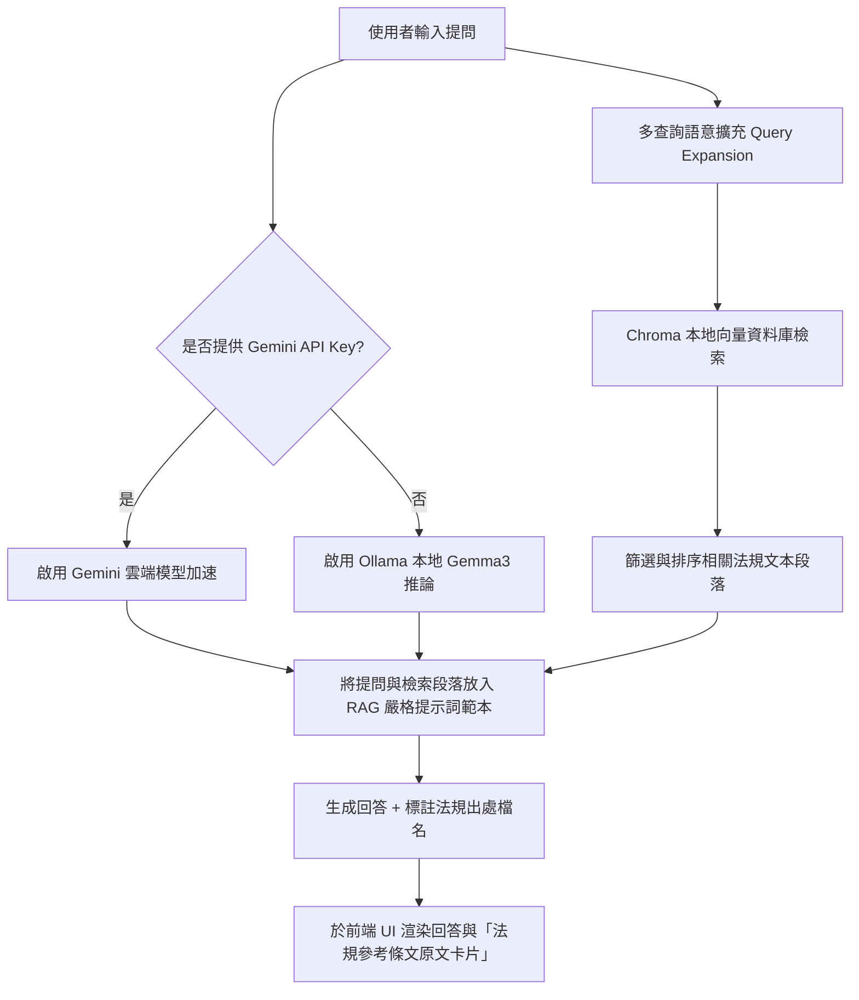

# 🎓 SCU 法規規範智慧檢索系統 (管資期末 - Benson組)

[](https://www.python.org/)
[](https://streamlit.io/)
[](https://ollama.com/)
[](https://www.trychroma.com/)
[](LICENSE)

本專案是一個為東吳大學法規與規範設計的 **地端安全 + 雲端加速雙模 RAG (Retrieval-Augmented Generation) 智慧檢索系統**。

系統具備**嚴格防幻覺機制**，限制大語言模型只能根據您提供的法規 PDF 檔案內容進行回答，杜絕 AI 瞎編。每次回覆均會**嚴謹標註參考出處與檔名**，並提供**原文對照展開**功能，是兼顧個人隱私與檢索準確度的智慧檢索解決方案。

> [!TIP]
> 📌 **穩定版本還原備忘錄**：若系統在後續開發中遇到不穩定，可隨時於終端機執行 `git checkout 3e324ab` 還原到此穩定版。

---

## 🌟 系統特色與亮點

*   🎨 **Neobrutalism (新野獸主義) 視覺設計**：前端介面採用莫蘭迪色系與奶油黃背景，搭配粗邊框、硬陰影與手繪條紋裝飾，打破傳統網頁的呆板感。
*   🔒 **地端安全隱私保障 (Ollama)**：預設使用純地端 `Ollama` + `Gemma 3` 運行，所有法規 PDF 與提問完全不出網，100% 保障資料隱私。
*   🤖 **macOS 專屬 Ollama 自動喚醒**：地端模式下，若偵測到本地 Ollama 服務未開啟，系統會自動在 macOS 背景啟動 Ollama 應用程式，免除手動點開的麻煩。
*   ✍️ **打字機串流與首字延遲優化**：重構問答渲染邏輯，使用 `st.write_stream` 逐字打字渲染；在背景檢索及 LLM 生成首字的等待期（TTFT）自動顯示「🔍 正在檢索本地知識庫並思考中...」狀態，完全擺脫氣泡初始空白的現象。
*   ⚡ **雙開關切換 (加速模式 & 純地端模式)**：
    *   **「⚡ 查詢加速模式」**：開啟後跳過查詢擴展，直接檢索與生成，於地端模式下提供 **秒級回應** 的極速體驗。
    *   **「🦉 純地端模式」**：開啟後將忽略 API 金鑰，完全改由本地 Ollama 推理，方便在 Demo 時一鍵切換展示純地端實力。
*   🔑 **`.env` 金鑰配置自動載入**：支援讀取本機根目錄 `.env` 檔案中的 `GEMINI_API_KEY`，系統啟動時會自動帶入輸入框並啟用「API 加速模式 ⚡」，省去 Demo 時複製貼上的繁瑣時間。
*   📚 **自動化向量資料庫建立**：只要將新的 PDF 檔案放進 `data/` 資料夾，RAG 引擎便會在初次運行時自動載入、切片、並將向量存入本地的 `chroma_db/` 資料庫。
*   📋 **出處回溯與防幻覺**：在系統提示詞中施加強烈約束，若檢索資料中沒有答案，系統會禮貌拒答而非捏造事實。回覆下方會顯示手繪風格的「條文原文卡片」供交叉核對。

---

## 🏗️ 系統技術架構

本系統採用經典的 **RAG (檢索增強生成)** 工作流：



---

## 📂 專案目錄結構

```text
├── app.py                  # Streamlit 網頁主程式 (Neobrutalism UI 設計)
├── requirements.txt         # 系統 Python 套件依賴清單
├── test_rag.py              # RAG 整合端到端測試指令
├── test_retrieval.py        # 檢索引擎與分詞翻譯單元測試指令
│
├── backend/                 # 後端模組資料夾
│   ├── main.py              # 後端 API 主入口
│   ├── requirements.txt     # 後端依賴
│   └── services/
│       ├── rag_service.py   # RAG 核心檢索與生成邏輯 (Chroma + Ollama/Gemini)
│       └── title_mapping.json  # 檔案名稱與法規名稱對照表
│
├── chroma_db/               # 本地向量資料庫目錄 (儲存向量化後的法規數據)
├── data/                    # 原始法規 PDF 存放處 (在此放入 PDF 以自動建檔)
└── frontend/                # React + Vite 前端專案目錄 (備用進階 Web UI)
```

---

## 🛠️ 安裝與開發環境部署

請先開啟您的終端機 (Terminal)，切換至本專案的根目錄：
```bash
cd "/Users/bensonhong/Desktop/Antigravity專案/管哩資訊系統期末（Benson組)"
```

### 1. 安裝 Python 套件依賴
建議使用 Python 3.10 以上版本，執行以下指令安裝所需套件：
```bash
python3 -m pip install -r requirements.txt
```

### 2. 安裝並運行地端大語言模型 (Ollama 模式)
如果您想使用 100% 本地地端模式，請完成以下步驟：
1. 前往 [Ollama 官方網站](https://ollama.com/) 下載並安裝適用於 Mac 的應用程式。
2. **自動啟動 (macOS 專屬)**：本系統在載入或執行時，會**自動偵測並開啟本機的 Ollama 軟體**，您無須手動開啟。*(若您使用的是其他系統或自動啟動未生效，則請確保手動啟動 Ollama 應用程式)*。
3. 打開終端機，拉取專案所需的嵌入模型與生成模型：
   ```bash
   # 下載向量嵌入模型
   ollama pull nomic-embed-text
   
   # 下載主推論語言模型
   ollama pull gemma3
   ```
4. 確保 Ollama 在背景持續運行 (預設埠口為 `http://localhost:11434`)。

### 3. 配置 Gemini API 金鑰 (雲端加速模式)
如果您想使用雲端 API 加速模式，可前往 [Google AI Studio](https://aistudio.google.com/) 免費申請 Gemini API Key。
為了在 Demo 演示時**零手動準備**，本系統支援讀取環境變數配置檔：
1. 在專案根目錄下建立一個 `.env` 檔案。
2. 在檔案中寫入以下配置（或直接修改已產生的 `.env` 檔案）：
   ```text
   GEMINI_API_KEY=您的_GEMINI_API_金鑰
   ```
3. 啟動系統時，網頁輸入框將自動載入該金鑰並自動開啟「API 加速模式 ⚡」。在 Demo 現場您亦可直接於網頁左側的 **「⚙️ 系統配置」** 隨時覆蓋貼上。

---

## 🚀 啟動與測試

### 方案一：啟動 Streamlit 視覺化檢索介面
這是最直覺的測試方式，能開啟精美的網頁介面對話：
```bash
python3 -m streamlit run app.py
```
* 執行後，瀏覽器會自動開啟 [http://localhost:8501](http://localhost:8501)（或視埠口佔用情況開啟 [http://localhost:8502](http://localhost:8502)）。

### 方案二：執行 RAG 整合測試腳本
在終端機中直接模擬 RAG 檢索流程（包含 Ollama 喚醒、向量庫搜尋與模型生成）：
```bash
python3 test_rag.py
```

### 方案三：執行 檢索單元測試
測試分詞、Boosting 加權、中英跨語言語意增強是否能正常運作：
```bash
python3 test_retrieval.py
```

### 方案四：執行 45 題地端規章自動評估問答集
在不消耗 Gemini API 限額的情況下，完全在地端執行 45 個高質量提問（涵蓋各大規章）的 RAG 檢索與回答生成，並自動產出精美的 Markdown 問答報告：
```bash
python3 scratch/run_faq_evaluation.py
# 執行後會在背景呼叫地端模型，並將成果格式化存入 demo_faq_45.md 中
```

---

## 📚 目前已載入之法規資料庫 (置於 `data/` 目錄)

*   東吳大學學生會會費代收辦法
*   東吳大學碩、博士班優秀新生獎勵辦法
*   東吳大學學生獎懲委員會組織章程
*   東吳大學學生清寒急難救助金實施辦法
*   東吳大學獎助學金申請審核辦法
*   東吳大學學生請假規則 (Soochow University Student Leave Regulations)
*   東吳大學端木愷校長獎學金實施要點
*   東吳大學學生銷過實施辦法
*   東吳大學學生社團組織及活動辦法
*   東吳大學校外學生宿舍輔導及管理辦法
*   東吳大學學生工讀助學實施辦法
*   東吳大學優秀應屆畢業生選拔及獎勵辦法
*   東吳大學研究生獎助學金辦法
*   東吳大學優良導師獎勵辦法

---

## 📌 穩定版本還原備忘錄

若系統後續進行其他開發時遇到不穩定、Bug 或回答混淆的情形，可隨時還原到本穩定版（已完成 463 筆 FAQ 口語自訓練、且實施了 RAG 主題感知 Context 淨化過濾器的版本）：

```bash
git checkout 3e324ab
```
