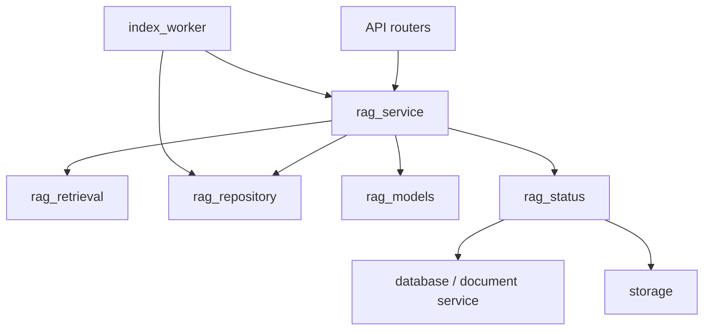

# Backend Architecture

FastAPI 路由只處理 HTTP 驗證與序列化；文件生命週期、索引與 RAG 分別由 service modules 負責。

## RAG modules

| Module | Responsibility |
| --- | --- |
| `rag_service.py` | 向量索引生命週期、查詢擴展與回答串流 orchestration |
| `rag_retrieval.py` | Dense/BM25 檢索、RRF、來源優先排序與文件去重 |
| `rag_repository.py` | PDF 路徑、managed manifest、FAQ、標題映射與 index metadata |
| `rag_models.py` | Ollama 健康探測、embedding 與 chat model lifecycle |
| `rag_status.py` | RAG、PostgreSQL、storage、worker 與 index job 狀態聚合 |

`rag_service.py` 暫時保留既有 helper aliases，避免破壞 scripts 與外部使用者；新程式應直接匯入實際擁有該責任的模組。

## Dependency direction

避免讓 `rag_retrieval` 或 `rag_repository` 反向匯入 `rag_service`。索引 worker 只有在執行完整 Chroma build 時才延遲匯入 `rag_service.init_vector_db`，以避免啟動時循環相依。

## Change guidance

- 新增檢索排名演算法或 filter fallback：放在 `rag_retrieval.py`。
- 修改 FAQ、manifest、檔案掃描或 metadata：放在 `rag_repository.py`。
- 修改 Ollama model 建立方式：放在 `rag_models.py`。
- 修改 `/api/status` 聚合欄位：放在 `rag_status.py`。
- 修改完整問答流程、provider fallback 或 streaming event：放在 `rag_service.py`。
