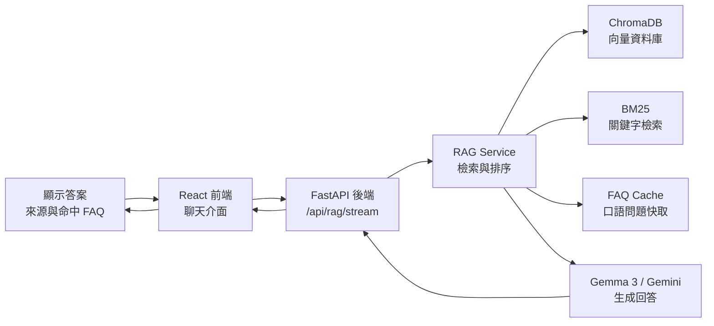
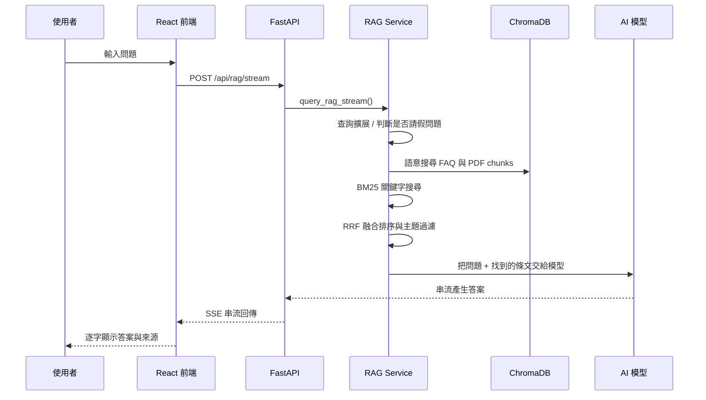
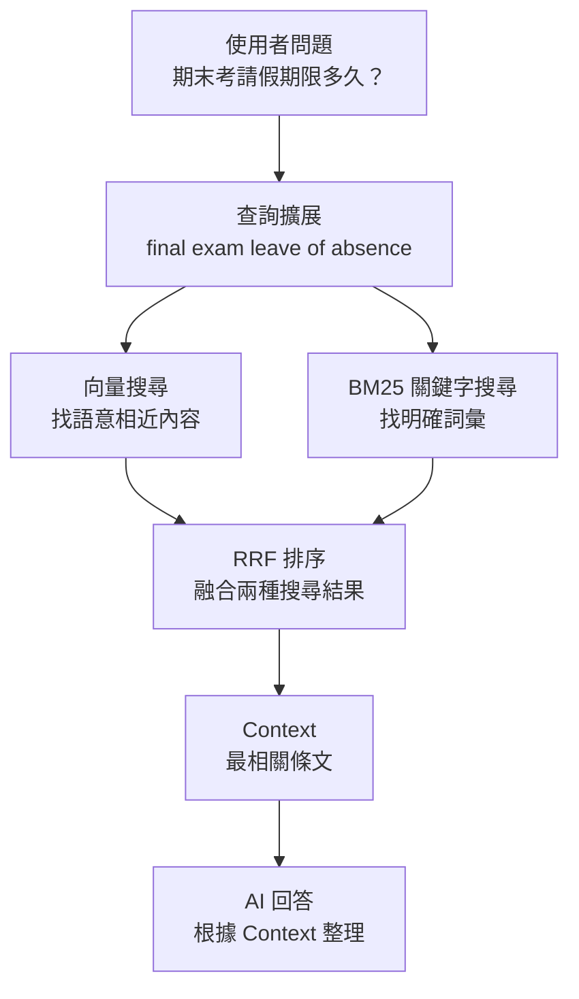
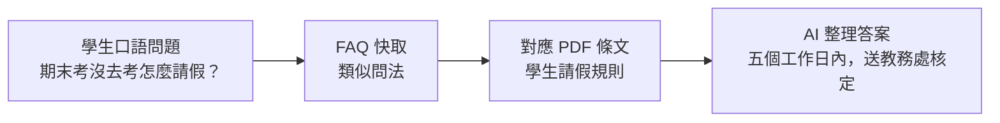
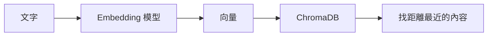
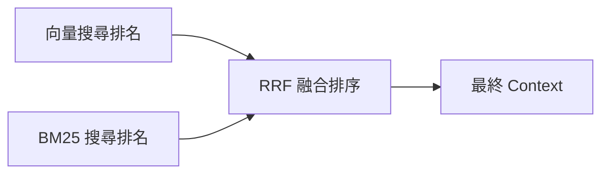

# 東吳規章智慧導航員：上台報告說明稿

## 1. 一句話介紹這個系統

這個系統是一個「本地端 RAG 校園規章問答系統」。使用者用自然語言提問，例如「期末考請假期限多久？」，系統會先從本機的 PDF 法規與 FAQ 快取中找出最相關的條文，再交給 AI 根據找到的內容回答，並附上來源。

可以這樣講：

> 我們不是讓 AI 直接亂猜答案，而是先讓系統查資料，再讓 AI 根據查到的法規內容回答。因此它比較像一位會翻法規、會整理重點的助理。

## 2. 系統整體架構



### 白話解釋

- 前端 React：負責畫面、輸入框、聊天泡泡、串流顯示答案。
- FastAPI：負責接收前端問題，呼叫後端 RAG 邏輯。
- RAG Service：系統核心，負責搜尋、排序、組合上下文、呼叫 AI。
- ChromaDB：本地向量資料庫，負責語意搜尋。
- BM25：傳統關鍵字搜尋，補強精準字詞命中。
- LLM：大型語言模型，負責把找到的資料整理成自然語言回答。

## 3. 使用者提問後，伺服器怎麼跑？



### 逐步說明

1. 使用者在前端輸入問題。
2. 前端把問題送到 FastAPI 的 `/api/rag/stream`。
3. FastAPI 呼叫 `query_rag_stream()`。
4. 系統判斷問題是否需要查詢擴展，例如請假問題會加入英文搜尋句。
5. 系統用 ChromaDB 做語意搜尋，找出意思相近的 FAQ 和 PDF 條文。
6. 系統同時用 BM25 做關鍵字搜尋，補強像「工讀」、「請假」、「端木愷」這類明確詞。
7. 系統用 RRF 把語意搜尋和關鍵字搜尋的結果融合排序。
8. 系統把最相關的資料組成 Context。
9. AI 模型只能根據 Context 回答，不能自由幻想。
10. 回答透過串流方式回到前端，所以畫面會逐步出現文字。

## 4. 問題和答案是怎麼配對上的？

系統不是直接把問題丟給 AI，而是分成「找資料」和「生成答案」兩階段。



### FAQ 怎麼幫忙？

PDF 法規通常寫得很正式，例如：

> 學期考試請假應於考試結束後五個工作日內提出申請。

但學生可能會問：

> 期末考沒去考，請假期限多久？

這兩句話意思接近，但字面不同。FAQ cache 的作用就是把很多「學生口語問法」先存起來，讓系統更容易把口語問題對到正確法規。

可以這樣理解：



## 5. 什麼是 RAG？

RAG 是 Retrieval-Augmented Generation，中文可以叫「檢索增強生成」。

拆開來看：

- Retrieval：先搜尋資料。
- Augmented：把搜尋到的資料補給 AI。
- Generation：AI 根據資料生成回答。

普通 AI 問答像是：

> 使用者問問題 → AI 直接回答。

RAG 問答像是：

> 使用者問問題 → 系統先查法規 → 把查到的條文交給 AI → AI 根據條文回答。

所以 RAG 的好處是：

- 比較不容易產生幻覺。
- 可以引用學校自己的 PDF。
- 可以顯示來源。
- 文件更新後，可以重新建立知識庫。

## 6. 什麼是 FastAPI？

FastAPI 是 Python 的後端 API 框架。

你可以把它想成「前端和 AI 系統之間的櫃台」：

- 前端把問題交給 FastAPI。
- FastAPI 負責把問題轉交給 RAG Service。
- RAG Service 找資料、呼叫 AI。
- FastAPI 再把答案送回前端。

本專案主要 API：

| API | 功能 |
|---|---|
| `GET /` | 確認後端是否在線 |
| `GET /api/status` | 回傳知識庫狀態、PDF 數量、FAQ 數量、Ollama 狀態 |
| `POST /api/rag` | 一次性回傳完整答案 |
| `POST /api/rag/stream` | 串流回傳答案，前端可以逐字顯示 |

## 7. 什麼是 ChromaDB？

ChromaDB 是向量資料庫。

一般資料庫是用文字或 ID 查資料，向量資料庫是用「意思」查資料。

例如：

> 「期末考請假」  
> 「final exam leave」  
> 「考試缺席申請」

這三句字面不同，但意思接近。向量資料庫會把它們轉成數學向量，距離越近代表語意越接近。



## 8. 什麼是 Embedding？

Embedding 是把文字轉成一串數字。

例如：

```text
「請假規則」 → [0.12, -0.33, 0.87, ...]
```

這串數字代表文字的語意位置。意思接近的句子，向量距離會比較近。

本系統使用 `nomic-embed-text` 作為本地 embedding 模型。

## 9. 什麼是 BM25？

BM25 是一種傳統關鍵字搜尋演算法。

它不像向量搜尋看「語意」，而是看關鍵詞出現的程度。例如使用者問「端木愷校長獎學金」，BM25 會很重視「端木愷」這個明確詞。

為什麼要同時用 ChromaDB 和 BM25？

| 方法 | 擅長 |
|---|---|
| ChromaDB 向量搜尋 | 找意思相近的內容 |
| BM25 關鍵字搜尋 | 找明確關鍵字、人名、法規名稱 |

兩者一起用，準確度會比只用一種更穩。

## 10. 什麼是 RRF？

RRF 是 Reciprocal Rank Fusion，中文可以叫「倒數排序融合」。

它的作用是把多個搜尋結果合併排序。

例如：

- ChromaDB 覺得 A 條文最相關。
- BM25 覺得 B 條文最相關。
- RRF 會綜合兩邊排名，決定最後要放哪些內容給 AI。



## 11. 什麼是 Ollama？

Ollama 是在本機執行 AI 模型的工具。

本系統可以用 Ollama 在本機跑：

- `gemma3`：負責生成回答。
- `nomic-embed-text`：負責文字向量化。

好處：

- 不一定需要雲端 API。
- 隱私性較高。
- 文件內容可以留在本機。

## 12. 什麼是 Gemini API 加速模式？

如果使用者輸入 Gemini API Key，系統可以改用 Gemini 生成回答或做查詢擴展。

但即使用 API 加速，資料檢索仍然是從本機 PDF / FAQ / ChromaDB 取得，不是讓 AI 憑空回答。

可以這樣說：

> API 加速模式只是讓生成速度更快，核心資料來源仍然是我們本地建立的法規知識庫。

## 13. 為什麼系統比較不容易亂答？

因為 Prompt 裡要求 AI：

1. 只能根據 Context 回答。
2. 找不到就要回答找不到。
3. 要標註資料來源。
4. 對期限、金額、單位等重點加粗。

所以 AI 的角色不是「自己想答案」，而是「根據找到的資料整理答案」。

## 14. 上台可以怎麼講：簡短版流程

你可以照這段講：

> 使用者在前端輸入問題後，React 會把問題送到 FastAPI 後端。後端的 RAG Service 會先判斷問題類型，必要時做查詢擴展。接著系統會同時使用 ChromaDB 做語意搜尋，以及 BM25 做關鍵字搜尋，從 PDF 法規和 FAQ 快取中找出最相關的內容。找到資料後，系統用 RRF 把搜尋結果融合排序，再把最重要的條文組成 Context 交給 AI。最後 AI 只能根據這些 Context 產生答案，並回傳來源。這樣可以降低 AI 幻覺，也能讓回答有依據。

## 15. 上台可以怎麼講：比較完整版本

> 我們的系統採用 RAG 架構，也就是 Retrieval-Augmented Generation。傳統聊天機器人可能直接把問題丟給 AI，讓 AI 根據模型記憶回答；但我們的做法是先查資料，再回答。  
>
> 首先，PDF 法規會被切成多個文字片段，並透過 embedding 模型轉成向量，存進 ChromaDB。除此之外，我們也建立 FAQ cache，把學生可能會問的口語問題一起放進知識庫。  
>
> 當使用者提問時，FastAPI 後端會接收問題，交給 RAG Service。RAG Service 會用向量搜尋找語意相近的內容，也會用 BM25 找關鍵字高度相關的內容。接著使用 RRF 將兩種搜尋結果融合排序，選出最相關的條文作為 Context。  
>
> 最後，AI 模型根據 Context 產生答案，並標註來源。因為模型不能脫離 Context 自由發揮，所以可以降低幻覺，讓回答更可靠。

## 16. 專有名詞速查表

| 名詞 | 白話解釋 |
|---|---|
| Frontend | 前端，使用者看到的畫面 |
| React | 製作前端介面的 JavaScript 框架 |
| Backend | 後端，處理資料和邏輯的伺服器 |
| FastAPI | Python 後端 API 框架 |
| API | 前後端溝通的接口 |
| RAG | 先搜尋資料，再讓 AI 根據資料回答 |
| LLM | 大型語言模型，例如 Gemma、Gemini |
| Embedding | 把文字轉成向量數字 |
| Vector DB | 向量資料庫，用語意相似度找資料 |
| ChromaDB | 本系統使用的本地向量資料庫 |
| BM25 | 傳統關鍵字搜尋演算法 |
| RRF | 把多組搜尋結果融合排序的方法 |
| Context | 提供給 AI 的參考資料 |
| Prompt | 給 AI 的指令 |
| Ollama | 本機執行 AI 模型的工具 |
| Streaming | 串流回傳，答案一段一段出現 |
| SSE | Server-Sent Events，後端持續把資料推給前端 |

## 17. 老師可能會問的問題

### Q1：為什麼不用一般關鍵字搜尋就好？

因為學生問法通常很口語，跟法規文字不一定一樣。向量搜尋可以找語意相近的內容，BM25 則補強明確關鍵字，所以兩者一起用比較穩。

### Q2：AI 會不會亂編？

有可能，但我們透過 RAG 降低風險。AI 回答前會先拿到系統檢索出的 Context，Prompt 也要求它只能根據 Context 回答，找不到就說找不到。

### Q3：FAQ cache 的作用是什麼？

FAQ cache 儲存學生可能會問的口語問題。當使用者問法很生活化時，系統可以先命中類似 FAQ，再連回對應法規條文。

### Q4：為什麼需要 FastAPI？

FastAPI 是前端和後端 AI 邏輯的橋樑。前端負責畫面，FastAPI 負責接收問題、呼叫 RAG Service、把答案回傳。

### Q5：這個系統和 ChatGPT 直接回答有什麼不同？

ChatGPT 直接回答可能沒有學校最新法規，也不一定能附上來源。本系統會先查本地 PDF 法規，再根據查到的內容回答，因此更適合校園規章查詢。

## 18. 報告時可以強調的亮點

- 本地端知識庫：PDF 和 FAQ 都在本機處理。
- RAG 架構：降低 AI 幻覺。
- 雙重檢索：ChromaDB 語意搜尋 + BM25 關鍵字搜尋。
- FAQ 口語化：更貼近學生真實問法。
- 串流回答：前端體驗更像即時 AI 助手。
- 來源可追溯：回答會顯示參考法規與頁數。

